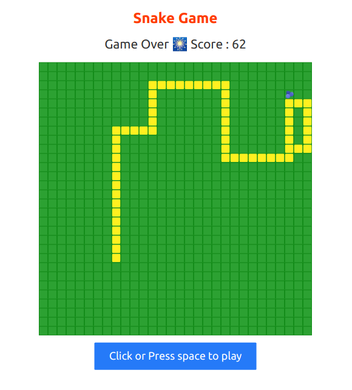

# Snake Game

Snake game implemented in React.js, Svelte, Vue.js and more 



## Start Local Development

### Install dependencies
install dependencies by running `yarn install` in root directory

### Run react app

```bash
cd snake-react
yarn start
```

### Run svelte app

```bash
cd snake-svelte
yarn dev
```
## Run vue app

```bash
cd snake-vue
yarn serve
```